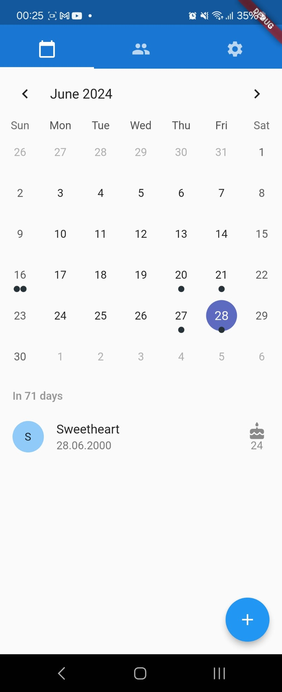

# Birthday Book app

Birthday book is an app which aims to show you all the birthdays of your contacts in a clean interface.
It automatically sends you reminders to send them a "happy birthday" message and can even automate that for you (if you want to).

## How to install

For help getting started with Flutter development, view the
[online documentation](https://docs.flutter.dev/), which offers tutorials,
samples, guidance on mobile development, and a full API reference.
